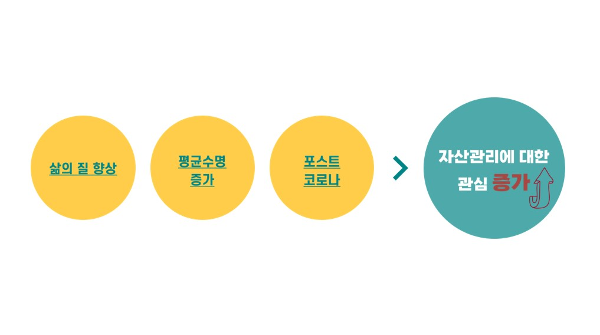
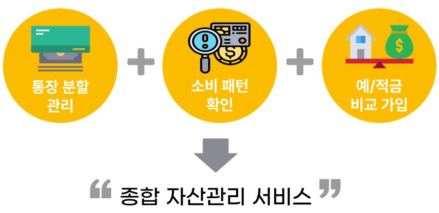
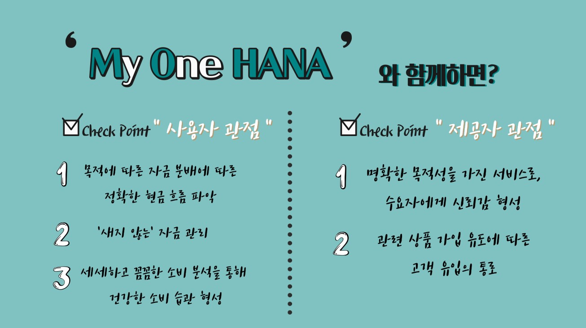
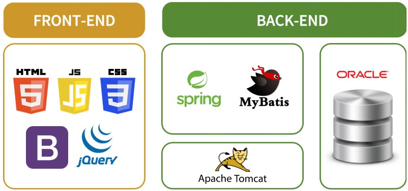
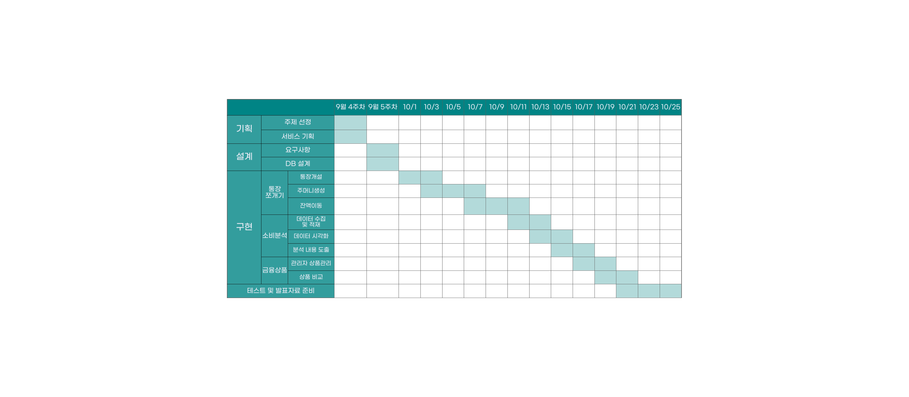

# '샐 틈 없는' 자산관리의 시작, My One HANA
[프로젝트 홈페이지 - https://uijeongg.github.io/One-Hana/](https://uijeongg.github.io/One-Hana/)
 

# 1. 프로젝트 개요

## 1-1. 프로젝트 선정 배경 및 목적
 
#### 이전 세대에서 ‘자산관리’라는 단어는 다수의 일반인들에게는 익숙하지 않은 단어였다. 하지만 우리 사회에서는 평균수명의 연장과 삶의 질 향상으로 인해 더욱 안정적이고 풍요로운 미래를 구축하고자 하는 사람들의 니즈가 점점 증가하고 있다. 거기에 포스트 코로나까지 더해져서, 자산관리에 대한 관심이 전방위적으로 증가하고 있다. 그에 따라 자산관리가 부자들의 전유물이라는 인식은 옛 것이 된지 오래다.

#### 이러한 시점에서 재테크 전문가들은 “통장을 쪼개야 한다” 라고 말한다. 그 이유가 무엇일까? 급여 소득과 지출이 하나의 통장에서 이루어지면 내 자산이 어디로, 얼마나 흘러가는지 명확하게 파악하기 힘들 것이다. 그에 따라 계획에 없던 지출인, 일명 ‘새는 돈’이 발생하게 된다. 

#### 여기에 착안하여, 통장 쪼개기를 통해 현금흐름을 명확히 파악하고, 새는 돈을 방지하여 저축으로 귀결시키는 일련의 과정 모두를 한번에 해결할 수 있는 플랫폼인 ‘마이원하나’ 서비스를 기획하게 되었다. 

#### 또한, 거기에 소비 패턴 분석과 금융 상품 제시까지 더하여 하나의 플랫폼 안에서 자산관리에 대한 모든 것을 해결할 수 있도록 '종합 자산 관리 서비스'인 My One HANA를 기획하게 되었다.

###  * 통장 쪼개기 : 급여통장을 목적에 맞게 여러 개로 나누어 활용하는 재테크 방법<br?

  

## 1-2. 프로젝트 기대효과
  

## 1-3. 프로젝트 개발환경

## 1-4. 시스템 아키텍처
  

## 1-5. 프로젝트 수행기간
  

 

# 2. 프로젝트 제안서
[제안서PPT](/MyOneHANA_제안서.pdf) 

    
  <iframe width="424" height="238" src="https://www.youtube.com/embed/reOGfxYJre0" title="YouTube video player" frameborder="0" allow="accelerometer; autoplay; clipboard-write; encrypted-media; gyroscope; picture-in-picture" allowfullscreen></iframe>

# 3. 프로젝트 결과
프로젝트 결과를 추가하세요. 발표자료. 시연동영상을 추가하세요.
    
   
    
## 발표 ppt 

[발표자료](/project.pptx) 
## 시연 동영상 

  <iframe width="424" height="238" src="https://www.youtube.com/embed/reOGfxYJre0" title="YouTube video player" frameborder="0" allow="accelerometer; autoplay; clipboard-write; encrypted-media; gyroscope; picture-in-picture" allowfullscreen></iframe>

# 4. 기타
그외 프로젝트를 더욱 설명할수 있는 것들을 추가하세요
 
# 5. 본인 소개

|이름 |정의정||
|연락처 | dmlwjd0202(@)naver.com|
|skill set| Frontend - HTML, CSS, Javascript|
| | Backend - Java, Spring, Oracle|
|자격증| 2021년 사회조사분석사2급 |
|| 2021년 ADsP |
|| 2022년 SQLD |
|수상| 2021년 노년층 금융 교육 서비스 우선 지역 파악 프로젝트 과학기술정보통신부 장관상  |

| | 20xx년 한국폴리텍대학 벤처창업아이템경진대회 대상 수상 (고용노동부 후원)  |
| | 20xx년 금융데이터경진대회 금상 수상|
| | 20xx년 대학생 논문 경진대회 은상 수상|
|특기사항|  TOEIC 990 |
||  리니지 만랩 |

|발표| [발표자료](/자기소개.pdf)  |
