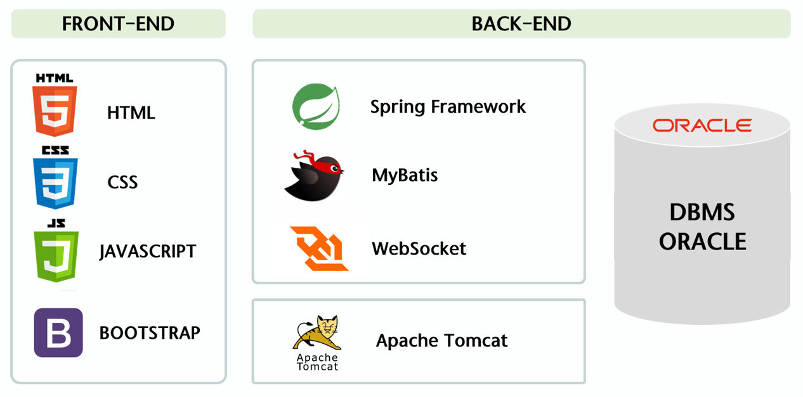

# '샐 틈 없는' 자산관리의 시작, My One HANA

[프로젝트 홈페이지 - https://uijeongg.github.io/One-Hana/](https://uijeongg.github.io/One-Hana/)

# 1. 프로젝트 개요

이것은 프로젝트 개요입니다. 글과 그림을 이용하여 개요를 설명하세요.

# 2. 프로젝트 제안서

프로젝트 제안서를 설명하세요. 발표자료와 동영상을 추가하세요. 시스템의 아키텍쳐 설명도 추가하세요.

 
[제안서PPT](/MyOneHANA_제안서.pdf) 
    
  <iframe width="424" height="238" src="https://www.youtube.com/embed/reOGfxYJre0" title="YouTube video player" frameborder="0" allow="accelerometer; autoplay; clipboard-write; encrypted-media; gyroscope; picture-in-picture" allowfullscreen></iframe>

# 3. 프로젝트 결과
프로젝트 결과를 추가하세요. 발표자료. 시연동영상을 추가하세요.
    
   
    
## 발표 ppt 

[발표자료](/project.pptx) 
## 시연 동영상 

  <iframe width="424" height="238" src="https://www.youtube.com/embed/reOGfxYJre0" title="YouTube video player" frameborder="0" allow="accelerometer; autoplay; clipboard-write; encrypted-media; gyroscope; picture-in-picture" allowfullscreen></iframe>

# 4. 기타
그외 프로젝트를 더욱 설명할수 있는 것들을 추가하세요
 
# 5. 본인 소개

|이름 |정의정||
|연락처 | dmlwjd0202(@)naver.com|
|skill set| Frontend - HTML, CSS, Javascript|
| | Backend - Java, Spring, Oracle|
|자격증| 2021년 사회조사분석사2급 |
|| 2021년 ADsP |
|| 2022년 SQLD |
|수상| 2021년 노년층 금융 교육 서비스 우선 지역 파악 프로젝트 과학기술정보통신부 장관상  |

| | 20xx년 한국폴리텍대학 벤처창업아이템경진대회 대상 수상 (고용노동부 후원)  |
| | 20xx년 금융데이터경진대회 금상 수상|
| | 20xx년 대학생 논문 경진대회 은상 수상|
|특기사항|  TOEIC 990 |
||  리니지 만랩 |

|발표| [발표자료](/자기소개.pdf)  |
